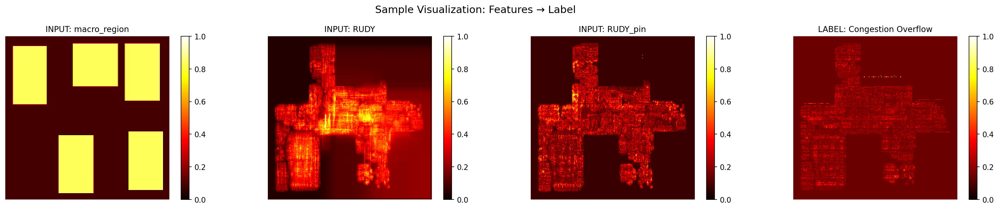
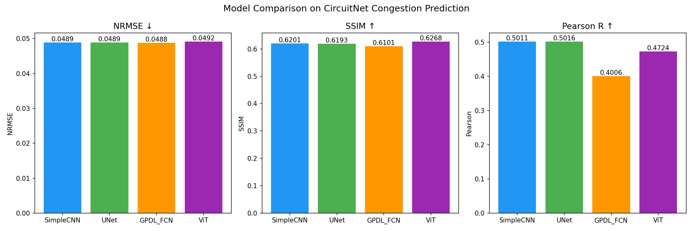
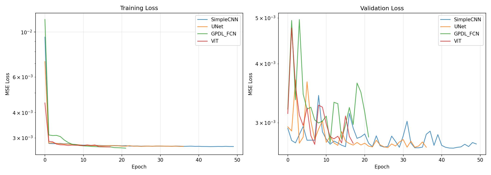
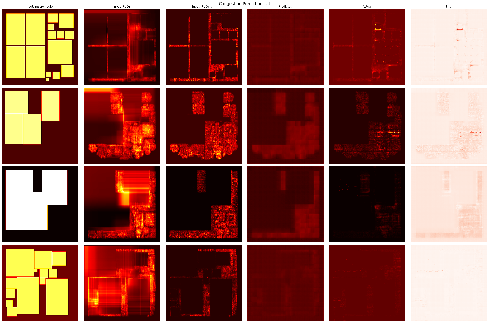
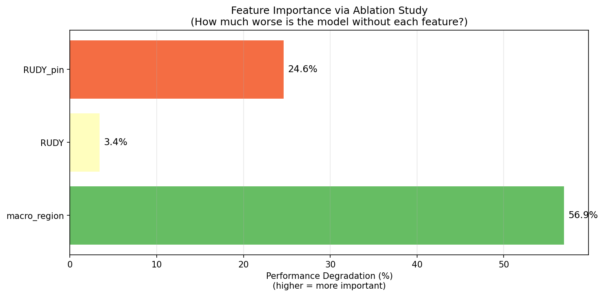
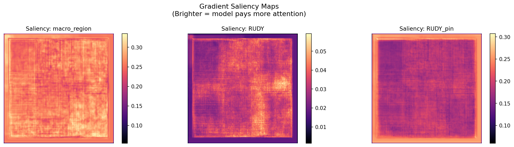

# Predicting Routing Congestion in Chip Design with Deep Learning

<p align="center">
  
</p>

**Can we predict where routing congestion will occur on a chip — before actually routing it?**

This project uses deep learning to predict routing congestion from placement-stage features, potentially replacing hours of traditional EDA tool runtime with millisecond-level neural network inference. Trained and evaluated on [CircuitNet](https://circuitnet.github.io/), a large-scale open benchmark dataset for chip design ML tasks.

---

## The Problem

In modern chip (VLSI) design, **routing congestion** is one of the biggest bottlenecks. After millions of logic gates are placed on a chip, wires must be routed to connect them. When too many wires compete for the same physical space, congestion occurs — leading to timing violations, design rule violations, and costly re-spins of the design cycle.

Traditional EDA tools detect congestion by running **global routing**, which can take **30 minutes to several hours** per design iteration. Designers often go through dozens of iterations, making this a massive time sink.

**The idea:** Train a neural network to predict the congestion map directly from placement-stage features. If it works, we get congestion estimates in **milliseconds instead of hours** — enabling rapid design space exploration.

## Approach

### Input Features (3 channels, 256×256)

| Channel | Feature | What it captures |
|---------|---------|-----------------|
| 0 | **macro_region** | Location of macro blocks (memory, IP) — physical obstacles wires must route around |
| 1 | **RUDY** | Rectangular Uniform wire DensitY — estimated routing demand per grid cell |
| 2 | **RUDY_pin** | Pin-weighted RUDY — routing demand weighted by pin locations |

### Target Label (1 channel, 256×256)

Combined horizontal + vertical routing overflow from global routing — the ground truth congestion map.

### Architectures Compared

| Model | Type | Parameters | Key Idea |
|-------|------|-----------|----------|
| **SimpleCNN** | Baseline CNN | 186K | Stack of conv layers, no downsampling |
| **U-Net** | Encoder-decoder + skip connections | 31M | Multi-scale features with fine-grained spatial detail |
| **GPDL FCN** | Encoder-decoder, no skip connections | 25M | Replicates the [GPDL paper](https://arxiv.org/abs/2106.08626) baseline |
| **ViT** | Vision Transformer + CNN decoder | 12M | Global self-attention captures chip-wide spatial relationships |

## Results

### Model Comparison

<p align="center">
  
</p>

| Model | NRMSE ↓ | SSIM ↑ | Pearson R ↑ | Training Time |
|-------|---------|--------|-------------|---------------|
| SimpleCNN | 0.0489 | 0.6201 | 0.5011 | 411 min |
| U-Net | 0.0489 | 0.6193 | **0.5016** | 1295 min |
| GPDL FCN | **0.0488** | 0.6101 | 0.4006 | 113 min |
| **ViT** | 0.0492 | **0.6268** | 0.4724 | **65 min** |

**Key findings:**
- **ViT achieves the best structural similarity (SSIM = 0.6268)** while being the fastest to train — self-attention captures global chip-level spatial patterns that CNNs miss.
- **SimpleCNN matches U-Net's Pearson R** with 166× fewer parameters (186K vs 31M), suggesting skip connections provide limited benefit for this task.
- **GPDL FCN has the worst Pearson R (0.40)** — without skip connections, it loses fine spatial detail in the decoder.
- All models achieve **NRMSE ~0.049**, indicating the task has a performance floor with these features.

### Training Curves

<p align="center">
  
</p>

### Predicted vs. Actual Congestion Maps

<p align="center">
  
</p>

The model correctly identifies congestion hotspots around macro boundaries and in areas with high routing demand. Errors are concentrated in fine-grained details.

## Feature Importance Analysis

Understanding *which placement features matter most* for congestion prediction is as valuable as the prediction itself — it tells chip designers where to focus optimization effort.

### Ablation Study

<p align="center">
  
</p>

| Feature | NRMSE Without | Degradation | Importance |
|---------|--------------|-------------|------------|
| **macro_region** | 0.0768 | +0.0279 | **56.9%** |
| **RUDY_pin** | 0.0610 | +0.0120 | **24.6%** |
| RUDY | 0.0506 | +0.0017 | 3.4% |

**macro_region is overwhelmingly the most important feature** — removing it degrades performance by 57%. This makes physical sense: macro blocks are large obstacles that force wires to detour around them, creating congestion bottlenecks at their boundaries.

RUDY_pin (24.6%) captures where connection demand is concentrated. Plain RUDY (3.4%) is nearly redundant since RUDY_pin already subsumes most of its information.

### Gradient Saliency Maps

<p align="center">
  
</p>

Gradient saliency confirms the ablation findings: the model attends most strongly to macro_region (saliency: 0.260) and RUDY_pin (0.196), with minimal attention to RUDY (0.031).

## Practical Impact

| Approach | Runtime | Accuracy |
|----------|---------|----------|
| Traditional Global Routing | 30–120 min | Ground truth |
| **Neural Network (this project)** | **~5 ms** | NRMSE 0.049 |

That's a **~360,000× speedup** — enabling real-time congestion feedback during the placement stage, when changes are still cheap to make.

## Project Structure

```
congestion_prediction/
├── configs/
│   └── config.py                 # Central configuration (paths, hyperparameters)
├── src/
│   ├── models/
│   │   ├── simple_cnn.py         # Baseline CNN
│   │   ├── unet.py               # U-Net (encoder-decoder + skip connections)
│   │   ├── gpdl_fcn.py           # GPDL FCN (encoder-decoder, no skips)
│   │   └── vit_model.py          # Vision Transformer + CNN decoder
│   ├── dataset.py                # CircuitNet data loader
│   ├── train.py                  # Training loop with early stopping
│   ├── evaluate.py               # NRMSE, SSIM, Pearson metrics
│   ├── compare_models.py         # Train all models & generate comparison
│   ├── feature_importance.py     # Ablation study + gradient saliency
│   ├── visualize.py              # Prediction visualization
│   └── data_exploration.py       # Dataset statistics & distributions
├── results/                      # Saved plots and model checkpoints
├── data/                         # CircuitNet data (not tracked in git)
└── README.md
```

## ⚙️ Setup & Reproduction

### 1. Environment

```bash
conda create -n congestion python=3.9
conda activate congestion
conda install pytorch torchvision -c pytorch
pip install scikit-learn matplotlib tqdm numpy opencv-python
```

### 2. Dataset

Download [CircuitNet-N28](https://circuitnet.github.io/) (congestion task only):
- `macro_region.tar.gz`
- `RUDY-046.tar.gz`
- `RUDY_pin.tar.gz`
- `congestion_global_routing.zip`

Then preprocess with CircuitNet's official scripts:
```bash
python preprocess_scripts/generate_training_set.py \
    --task congestion \
    --data_path /path/to/circuitnet \
    --save_path /path/to/circuitnet/training_set
```

### 3. Training

```bash
# Train a single model
python src/train.py --model unet --epochs 50

# Train all models and compare
python src/compare_models.py

# Feature importance analysis
python src/feature_importance.py --model unet

# Visualize predictions
python src/visualize.py --model vit
```

## 📚 References

- **CircuitNet:** Chai et al., "CircuitNet: An Open-Source Dataset for Machine Learning in VLSI CAD" (2022). [Paper](https://arxiv.org/abs/2208.01040) | [Website](https://circuitnet.github.io/)
- **GPDL:** Lin et al., "Global Placement with Deep Learning-Enabled Explicit Routability Optimization" (2021). [Paper](https://arxiv.org/abs/2106.08626)
- **U-Net:** Ronneberger et al., "U-Net: Convolutional Networks for Biomedical Image Segmentation" (2015). [Paper](https://arxiv.org/abs/1505.04597)
- **ViT:** Dosovitskiy et al., "An Image is Worth 16x16 Words" (2020). [Paper](https://arxiv.org/abs/2010.11929)

## 📄 License

MIT License
